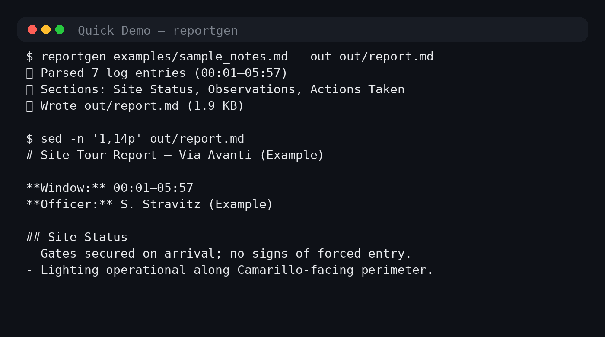

# Eclipse Dev Systems
[](https://github.com/SunshineEggs1235/eclipse-dev-systems/actions/workflows/ci.yml)


[](#)
[](#license)

Turn raw patrol notes / event logs into a clean, consistent, client-ready report—fast.

**Use case:** you have messy notes (timestamps, observations, actions taken) and you want a repeatable report format that reads like a professional incident/tour summary.

---

## What it does

- ✅ Parses a simple notes format (Markdown or plain text)
- ✅ Produces a structured report (Markdown by default)
- ✅ Keeps output consistent (headings, bullet cadence, tone)
- ✅ Works as a CLI so it fits into your daily workflow

---

## Quick Demo



---

## Install

### Option A (recommended): `pipx` (isolated CLI install)

```bash
python -m pip install --user pipx
python -m pipx ensurepath
pipx install git+https://github.com/<YOUR_GITHUB_USERNAME>/<REPO_NAME>.git
```

### Option B: regular `pip`

```bash
pip install git+https://github.com/<YOUR_GITHUB_USERNAME>/<REPO_NAME>.git
```

---

## Usage

### Basic

```bash
reportgen examples/sample_notes.md --out out/report.md
```

**Example output (terminal):**

```text
✅ Parsed 7 log entries (00:01–05:57)
✅ Sections: Site Status, Observations, Actions Taken
✅ Wrote out/report.md (1.9 KB)
```

**Output file (first lines):**

```md
# Site Tour Report — Via Avanti (Example)

**Window:** 00:01–05:57  
**Officer:** S. Stravitz (Example)

## Site Status
- Gates secured on arrival; no signs of forced entry.
- Lighting operational along Camarillo-facing perimeter.
```

### Help

```bash
reportgen --help
```

---

## Input format (example)

See: `examples/sample_notes.md`

Recommended structure:

- A title (first line)
- Timestamped bullets
- Short, factual lines (what you saw + what you did)

---

## Development

```bash
git clone https://github.com/<YOUR_GITHUB_USERNAME>/<REPO_NAME>.git
cd <REPO_NAME>

python -m venv .venv
source .venv/bin/activate  # Windows: .venv\Scripts\activate

pip install -U pip
pip install -e ".[dev]"   # if you use pyproject extras
# OR: pip install -r requirements-dev.txt
```

Run tests:

```bash
pytest -q
```

---

## CI (GitHub Actions)

This repo includes a simple CI workflow:

- runs on push + PR
- installs dependencies
- runs `pytest`

File: `.github/workflows/ci.yml`

---

## Roadmap

- [ ] Add JSON output mode (for downstream tooling)
- [ ] Add templates (client-specific headers / branding)
- [ ] Add validation (missing timestamps, malformed lines)

---

## License

MIT — see `LICENSE`.

---

### Replace-these checklist (so this README is truly *yours*)

- Replace `<YOUR_GITHUB_USERNAME>` and `<REPO_NAME>` everywhere
- Replace the “Example output” block with **your real run output**
- Update the title/description to match the project name
## License
MIT — see [LICENSE](LICENSE).

